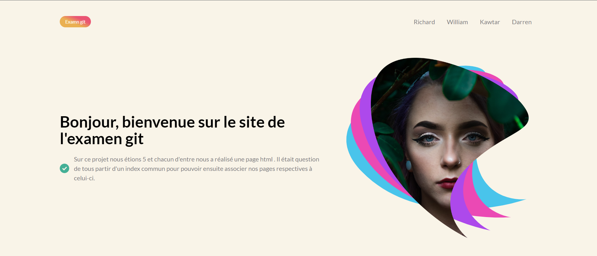
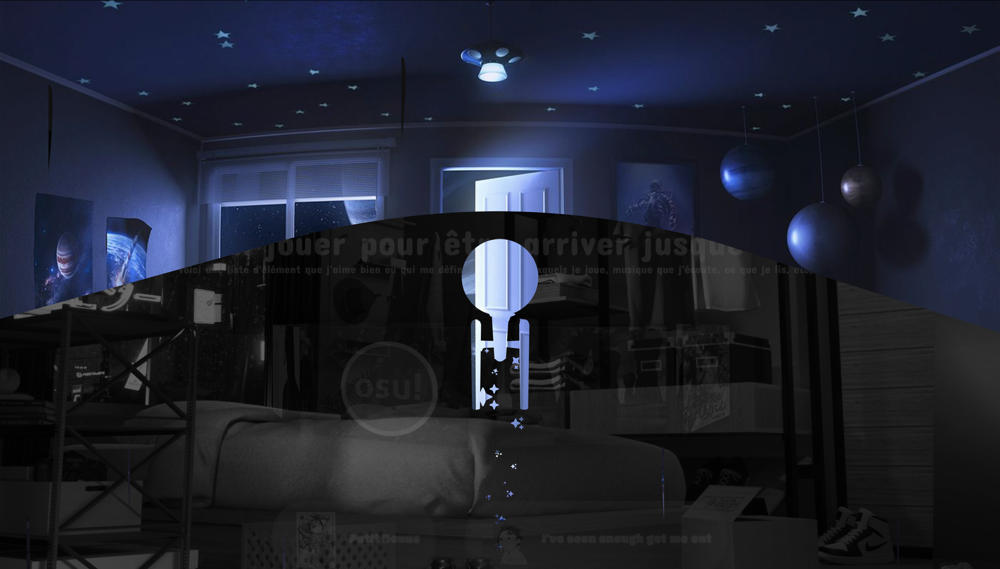
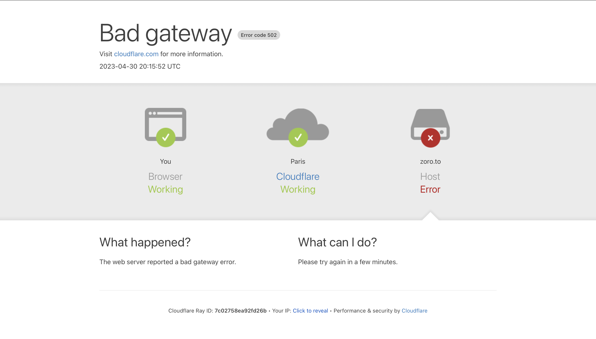

# Description :

Sur ce projet nous étions 5 et chacun d'entre nous a réalisé une page html .Il était question de tous partir d'un index et d'un css communs pour pouvoir ensuite associer nos pages respectives.

Technologie utilisé :

  - Html
  - Css
  - Javascript
  - Git
 

## screenshot :

# Page de Darren - Précisions / Explications

## 🪲  Bug d'animation :

La page de Darren est organisé en 1 page + 2 pages secrètes 🤫 .

Il y a une animation à l'arrivée sur la deuxième page. À la première connexion il se peut que l'animation ne s'affiche pas correctement.❌

Pour régler ce problème et pouvoir voir l'animation comme elle est,

il suffit d'actualiser la page 🔄(F5) et l'animation devrait se faire comme voulu.✅

## ✨ Pages Secrètes : ✨ 

### 🪲 Bug liens images :

sur une des pages secrètes on retrouve un carousel d'image. Toute les images sont clickables et redirigent vers des endroits inconnus à vous de les explorer 😉.

En cliquant sur certaines des images il se peut que vous n'arriviez pas à accéder au site voulu et que vous tombiez sur cette page :

Avec la méthode utilisée dans la projet il semblerait qu'en essayant d'accéder au site depuis une des pages secrètes la connexion ne soit pas reconnu.❓
On peut dire que pour une page secrète elle fait bien son travail. 🧐

Pour accéder au site veuillez actualiser 🔄 la page 2 ou 3 fois, après actualisation vous devriez pouvoir accéder au site. ✅

### 🐞 Bug fluidité carousel :

Le Carousel a été fait entièrement en css et probablement n'a pas été conçu de la meilleure façon possible.De ce fait on retrouve une perte de fluidités et de performance sur celui-ci. 📈 
Il se peut donc que durant votre expérience vous rencontriez des petits freeze. ❄️

Cela ne devrait pas empêcher l'accès à quelconques pages ni vous empêcher d'utiliser toute les fonctionnalités de la page. 👨‍🔬

Il n'y pas de solution à ce jour néanmoins nous travaillons sur l'issue et espérons pouvoir vous fournir une meilleure version du Carousel très Rapidement et espérant que vous apprécierai quand même le travail proposé. 📤

# Membre :

- Benaja BENDO
- Richard KOUDOU
- Darren NDOUONGO
- Kawtar TMIMI
- William ANDRÉ

